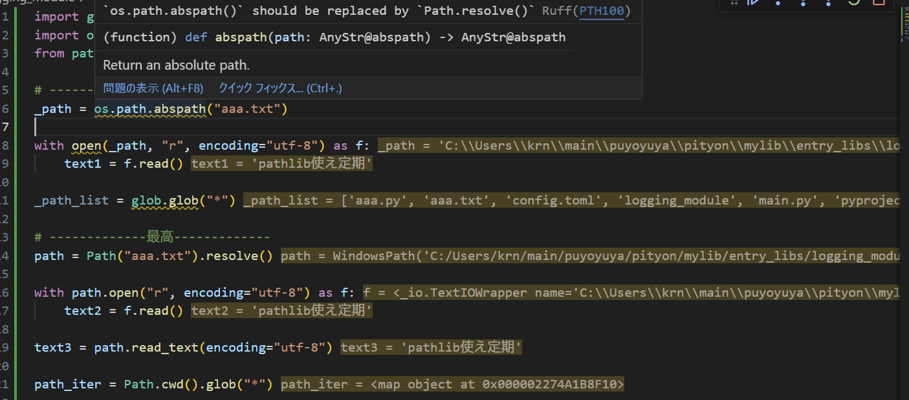
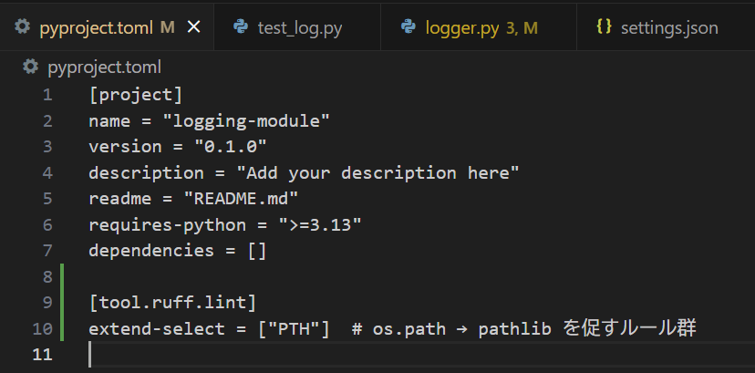

# 設定

## VSCodeエディター内レベル

ruffで以下の条件でフォーマットする
・保存時にフォーマット実行
・1行の文字の長さを120字まで耐えられるようにする
・pathlibの偉大さを伝える


setting.jsonに

```json
    "[python]": {
        "editor.formatOnSave": true,
        "editor.codeActionsOnSave": {
            "source.fixAll.ruff": "explicit",
            "source.organizeImports.ruff": "explicit"
        },
        "editor.wordBasedSuggestions": "off",
        "editor.defaultFormatter": "charliermarsh.ruff"
    },
    "ruff.lint.enable": true,
    "ruff.lineLength": 120, // 一行の長さを120字まで許可
    "ruff.lint.extendSelect": [
        "PTH" // パス操作をpathlib以外で行ってはいけない (理由: os.path, glob, openが保つ機能がPathに集約されている。write_text等の便利なメソッドがある。パス操作はos.pathだと関数in関数みたいに複雑になるが、pathlibだと楽。path.parent / "setting.toml"と同じ操作をos.pathでするとどうなるか、考えるだけで恐ろしい。)
    ],
    "ruff.lint.ignore": [
        "E714" // not a is Noneの書き方を許容 (理由: a is not Noneみたいな書き方は別に可読性変わらないし、新しい構文が増えるだけなのでむしろしたくない。not a is Noneはnotとa is Noneという既存の構文の組み合わせ)
    ] // Linter・Formatter無効化設定
```

と書く

## プロジェクトレベル

VSCodeエディター内レベルの設定と同じ種類の設定があればこっちが優先される

ruffで以下の条件でフォーマットする
・pathlibの偉大さを伝える

pyproject.tomlに

```toml
[tool.ruff.lint]
extend-select = ["PTH"]
```

と書く



